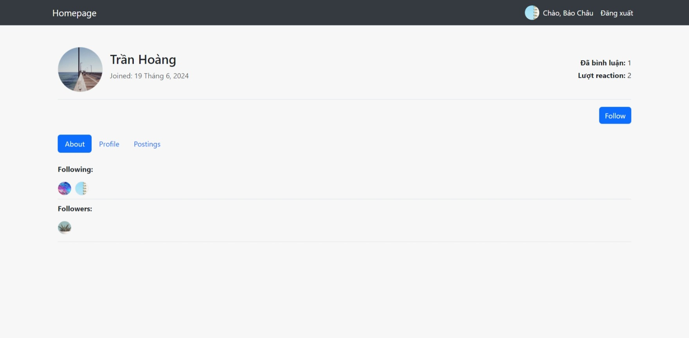

# Forum Website Pet Project

This project aims to create a simple forum.

## Main feature

- Post and like comments, and dynamically validate forms using htmx
- Auto-create user profiles on registration, view profiles, and follow users.
- Simple categorize threads

## Screenshot

